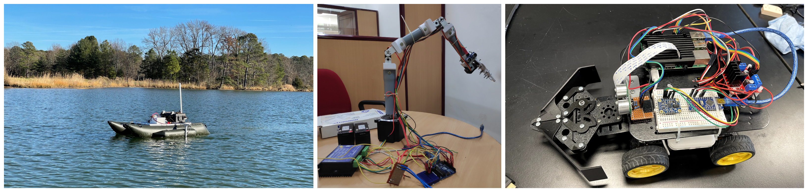
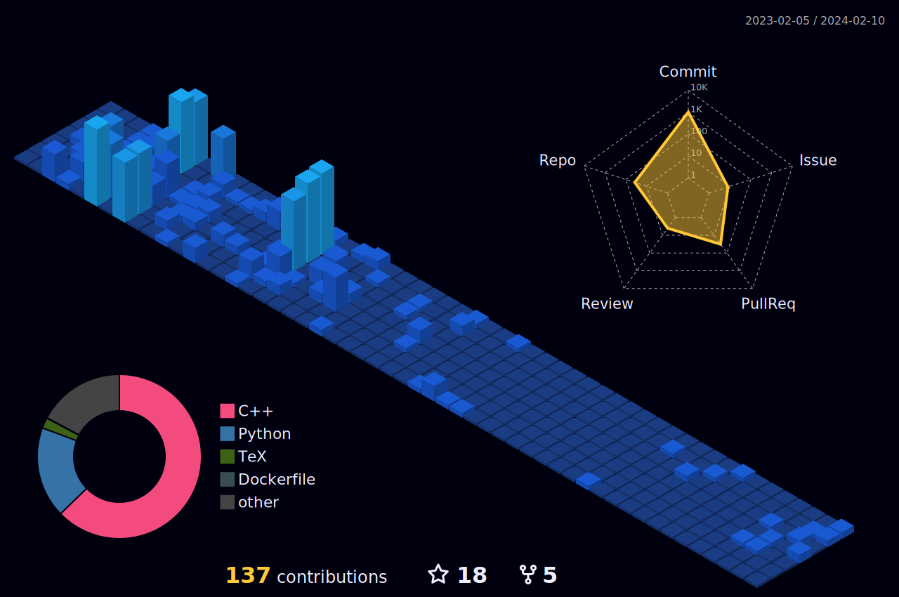

<h1 align="center">Naveen Anil</h1>

<h3 align="center">Robotics Graduate Student at the University of Maryland</h3>

### ⚡ What I'm up to
- 🔨 I'm currently...
	- Looking for full-time job opportunities to collaborate
	- Honing my skiills in Aerial Robotics
 	- Doing independent study with Prof. Zeid Kootbally 
<!-- - 🔨 𝙸’𝚖 𝚌𝚞𝚛𝚛𝚎𝚗𝚝𝚕𝚢 𝚠𝚘𝚛𝚔𝚒𝚗𝚐 𝚘𝚗 𝚊 𝚗𝚎𝚠 [**𝚒𝟹𝚕𝚘𝚌𝚔-𝚌𝚘𝚕𝚘𝚛**](https://github.com/Raymo111/i3lock-color) 𝚛𝚎𝚕𝚎𝚊𝚜𝚎 -->
- 🎯 In the near future, I plan to
	- Contribute to cutting edge developments in the field of Robotics
	- Write algorithms for autonomous systems and humanoid robots
	- Collaborate with researchers, engineers, and enthusiasts in the robotics community
	- Contribute to open-source robotics projects to help the community

<!-- 

	

 -->

### ⚡ Tech

  
  
  

  <!--  -->
<!--    -->
<!--    -->

<!--    -->

<!--    -->

  

### ⚡ Project Highlights

&nbsp;&nbsp;&nbsp;&nbsp;&nbsp;&nbsp;&nbsp;&nbsp;&nbsp;&nbsp;&nbsp;&nbsp;&nbsp;&nbsp;
    <strong><a href="link1">Autonomous Surface Vehicle (ASV)</a></strong>
    &nbsp;&nbsp;&nbsp;&nbsp;&nbsp;&nbsp;&nbsp;&nbsp;&nbsp;&nbsp;&nbsp;&nbsp;&nbsp;&nbsp;&nbsp;&nbsp;&nbsp;&nbsp;
    <strong><a href="link2">Collaborative Robotic Arm</a></strong>
&nbsp;&nbsp;&nbsp;&nbsp;&nbsp;&nbsp;&nbsp;&nbsp;&nbsp;&nbsp;&nbsp;&nbsp;&nbsp;&nbsp;&nbsp;&nbsp;&nbsp;&nbsp;&nbsp;&nbsp;&nbsp;&nbsp;&nbsp;&nbsp;&nbsp;&nbsp;&nbsp;&nbsp;&nbsp;&nbsp;&nbsp;&nbsp;&nbsp;&nbsp;&nbsp;&nbsp;&nbsp;&nbsp;
    <strong><a href="https://github.com/nvnanil/autonomy_through_sensor_fusion">Sensor Fusion</a></strong>

### ⚡ GitHub Activity

<!-- ### ⚡ Social -->
<h4 align="center">Check out for more</h4>

  
  

  
	
<!--  -->

  
	

